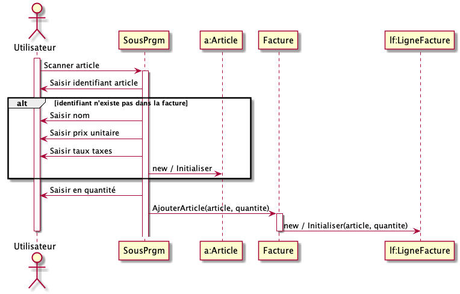
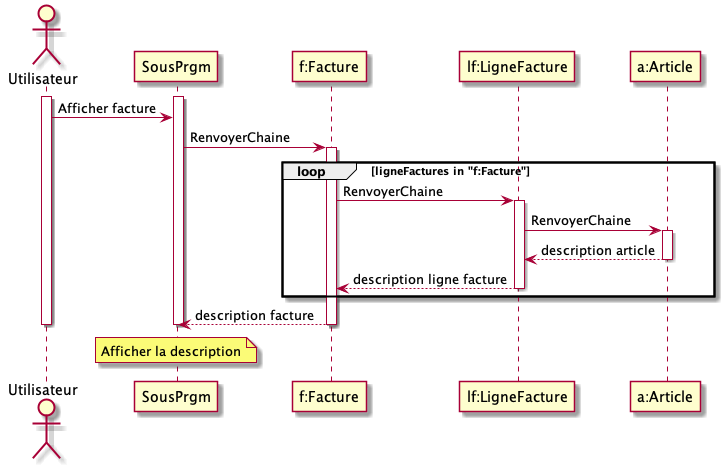

# Module 03 - Association

## Revisiter la facture

Soit le diagramme de classes suivant :


Créez le gabarit les classes du diagramme dans un nouveau projet Visual Studio.

La méthode "AjouterArticle" prend un article et une quantité en paramètres et l'ajouter à la liste des lignes de la facture. Si l'article existe déjà, seulement la quantité est mise à jour.

Les propriétés "NombreArticles", "TotalHT", "TotalTaxes" et "TotalTTC" renvoient respectivement le nombre d'éléments de la liste des lignes de la facture, le total hors taxes et le total avec taxes de la facture ou d'une ligne de facture suivant la classe qui les concernent.

Pour coder vos fonctions, aidez-vous des diagrammes suivants :





1. Codez ces méthodes.
2. Faites les tests unitaires de tout ce qui est "public".
3. Écrivez un sous-programme qui affiche le menu suivant :

```console
1. Nouvelle facture
2. Scanner un article
3. Afficher facture
4. Quitter
```